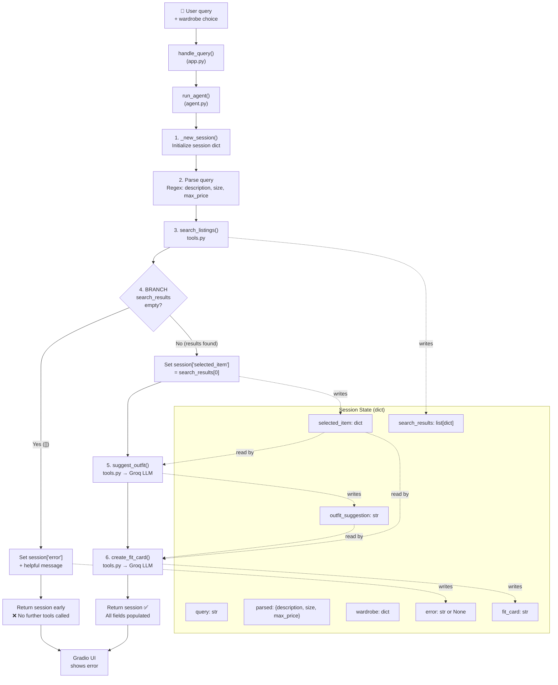

# FitFindr — planning.md

> Complete this document before writing any implementation code.
> Your spec and agent diagram are what you'll use to direct AI tools (Claude, Copilot, etc.) to generate your implementation — the more specific they are, the more useful the generated code will be.
> Your planning.md will be reviewed as part of your submission.
> Update it before starting any stretch features.

---

## Tools

List every tool your agent will use. For each tool, fill in all four fields.
You must have at least 3 tools. The three required tools are listed — add any additional tools below them.

### Tool 1: search_listings

**What it does:**
Filters the mock listings dataset by keyword relevance, optional size, and optional max price. Scores each listing by how many words from the user's description appear in the listing's title, description, and style_tags, then returns matches sorted from most to least relevant.

**Input parameters:**
- `description` (str): Free-text keywords describing what the user is looking for (e.g., "vintage graphic tee"). Used for keyword-matching against listing fields.
- `size` (str | None): Size to filter by, case-insensitive substring match (e.g., "M" matches "S/M" and "M"). If None, skip size filtering.
- `max_price` (float | None): Maximum price ceiling (inclusive). If None, skip price filtering.

**What it returns:**
A list of listing dicts, each containing: id (str), title (str), description (str), category (str), style_tags (list[str]), size (str), condition (str), price (float), colors (list[str]), brand (str or null), platform (str). Sorted by relevance score (highest first). Returns an empty list `[]` if no listings match — never raises an exception.

**What happens if it fails or returns nothing:**
The tool returns `[]`. The planning loop checks for this and sets `session["error"]` to a message like: "No listings matched your search for 'designer ballgown' (size XXS, max $5). Try broadening your description, removing the size filter, or increasing your max price." The agent returns early without calling suggest_outfit or create_fit_card.

---

### Tool 2: suggest_outfit

**What it does:**
Takes a thrifted item and the user's wardrobe, then calls the Groq LLM (llama-3.3-70b-versatile) to generate 1–2 complete outfit combinations. If the wardrobe is empty, it returns general styling advice for the item (e.g., what kinds of pieces pair well, what vibe it suits). The LLM prompt includes the new item's title, category, colors, style_tags, and price, plus the names, categories, colors, and style_tags of every wardrobe item.

**Input parameters:**
- `new_item` (dict): A listing dict from search_listings containing id, title, description, category, style_tags, size, condition, price, colors, brand, platform.
- `wardrobe` (dict): A dict with an `items` key containing a list of wardrobe item dicts. Each wardrobe item has: id (str), name (str), category (str), colors (list[str]), style_tags (list[str]), notes (str or null).

**What it returns:**
A non-empty string with outfit suggestions. For a non-empty wardrobe, it returns something like: "Pair this faded band tee with your baggy straight-leg jeans (w_001) and black combat boots (w_008) for a classic 90s grunge look. Layer your vintage black denim jacket (w_006) over it if it's chilly." For an empty wardrobe, it returns general advice like: "This graphic tee works great with light-wash baggy jeans and chunky sneakers for a streetwear vibe. Try tucking the front corner for shape."

**What happens if it fails or returns nothing:**
If the wardrobe is empty, the tool does NOT crash — it calls the LLM with a different prompt asking for general styling ideas instead of specific wardrobe pairings. If the LLM call fails (network error, API key issue), the tool catches the exception and returns a descriptive error string: "Sorry, I couldn't generate an outfit suggestion right now. Please try again." The agent stores this in session and continues — it does not crash the entire interaction.

---

### Tool 3: create_fit_card

**What it does:**
Generates a short, authentic social-media caption (2–4 sentences) for a thrifted outfit. Uses the Groq LLM with a higher temperature (0.9–1.0) to produce varied, casual OOTD-style text that mentions the item name, price, and platform naturally — like a real Depop/Instagram post, not a product description.

**Input parameters:**
- `outfit` (str): The outfit suggestion string returned by suggest_outfit. May be empty or whitespace-only — the tool guards against this.
- `new_item` (dict): The listing dict for the thrifted item (same structure as Tool 1 returns), used to extract title, price, platform, and style context.

**What it returns:**
A 2–4 sentence string suitable for social media. Example: "thrifted this faded band tee off depop for $24 and honestly it was made for my wide-legs 🖤 full look in my stories". Each call produces a different variation due to higher LLM temperature.

**What happens if it fails or returns nothing:**
If `outfit` is empty or whitespace-only, the tool returns a descriptive error string: "Couldn't generate a fit card — the outfit description was empty. Try running the search again." It does NOT raise an exception. If the LLM call fails, it catches the exception and returns: "Sorry, I couldn't create a fit card right now. Please try again."

---

### Additional Tools (if any)

<!-- Copy the block above for any tools beyond the required three -->

---

## Planning Loop

**How does your agent decide which tool to call next?**

The planning loop follows a strict linear pipeline with one critical branch. Here is the exact conditional logic:

1. **Initialize session:** Create a session dict with `_new_session(query, wardrobe)`. All tool inputs and outputs are stored here — no global variables.

2. **Parse the query:** Extract `description`, `size`, and `max_price` from the user's natural language query using regex patterns:
   - `max_price`: Match `$` followed by digits, or `under $N`, or `max $N`. Store as float.
   - `size`: Match `size X` or `size XS/S/M/L/XL` or standalone size words like `medium`, `large`. Case-insensitive.
   - `description`: Everything that's not a size or price specifier, cleaned up. Store in `session["parsed"]`.

3. **Call search_listings:** Pass `session["parsed"]["description"]`, `session["parsed"]["size"]`, and `session["parsed"]["max_price"]`. Store the returned list in `session["search_results"]`.

4. **BRANCH — check results (with retry logic):**
   - **IF `session["search_results"]` is empty (`[]`):** Enter retry loop.
     - **Retry 1:** Remove size filter, keep max_price. Call `search_listings` again. If results found, set `session["retry_adjustments"]` to note "size filter removed" and jump to step 4b (select item).
     - **Retry 2:** Also remove max_price filter. Call `search_listings` again. If results found, set `session["retry_adjustments"]` to note "size and price filters removed" and jump to step 4b.
     - **All retries exhausted:** Set `session["error"]` to a message explaining what was tried and what the user can adjust. Return the session immediately. **Do NOT call suggest_outfit or create_fit_card.**
   - **IF results exist (original or retry):** Set `session["selected_item"] = session["search_results"][0]` (the top-ranked match). Continue to step 5.

5. **Call suggest_outfit:** Pass `session["selected_item"]` and `session["wardrobe"]`. Store the returned string in `session["outfit_suggestion"]`.

6. **Call create_fit_card:** Pass `session["outfit_suggestion"]` and `session["selected_item"]`. Store the returned string in `session["fit_card"]`.

7. **Return the session dict.** The agent is done — `session["error"]` is None, and all three output fields (search_results, outfit_suggestion, fit_card) are populated.

The agent never calls tools conditionally based on LLM output — the sequence is deterministic. The only branch is the empty-results check after step 3.

---

## State Management

**How does information from one tool get passed to the next?**

All state lives in a single `session` dict created at the start of each interaction. Nothing is stored globally or between interactions — each call to `run_agent()` gets a fresh session.

**Session dict fields:**

| Field | Type | Set by | Used by |
|-------|------|--------|---------|
| `query` | str | `_new_session()` | (reference only) |
| `parsed` | dict | Query parser (step 2) | `search_listings` |
| `parsed.description` | str | Query parser | `search_listings` (1st arg) |
| `parsed.size` | str or None | Query parser | `search_listings` (2nd arg) |
| `parsed.max_price` | float or None | Query parser | `search_listings` (3rd arg) |
| `search_results` | list[dict] | `search_listings` return | Branch check; top result → selected_item |
| `selected_item` | dict or None | Planning loop (step 4) | `suggest_outfit` (1st arg), `create_fit_card` (2nd arg) |
| `wardrobe` | dict | `_new_session()` | `suggest_outfit` (2nd arg) |
| `outfit_suggestion` | str or None | `suggest_outfit` return | `create_fit_card` (1st arg) |
| `fit_card` | str or None | `create_fit_card` return | Final output |
| `error` | str or None | Planning loop (branch) | Checked by caller before using outputs |
| `retry_adjustments` | str or None | Planning loop (retry) | Informs user what filters were loosened |
| `price_comparison` | str or None | `compare_price()` (stretch) | Displayed in price check panel |
| `trend_insight` | str or None | `get_trend_insight()` (stretch) | Displayed in trend check panel |
| `profile_summary` | str or None | `get_profile_summary()` (stretch) | Displayed in style profile panel |

**Data flow between tools:**
- `search_listings` output → `session["search_results"]` → top result extracted as `session["selected_item"]`
- `session["selected_item"]` → passed as `new_item` to `suggest_outfit`
- `session["outfit_suggestion"]` + `session["selected_item"]` → passed to `create_fit_card`
- No tool reads from another tool directly — all data flows through the session dict.

---

## Error Handling

For each tool, describe the specific failure mode you're handling and what the agent does in response.

| Tool | Failure mode | Agent response |
|------|-------------|----------------|
| search_listings | No results match the query | **With retry logic (stretch):** Agent first tries with all user-specified filters. If empty, it retries with the size filter removed. If still empty, it retries with both size and max_price removed. Each retry logs what was adjusted. Only if all retries fail does it set `session["error"]` with a message that explains what was tried: "No listings matched even after removing size and price filters. Try different keywords." The agent returns early — does NOT call suggest_outfit or create_fit_card. |
| suggest_outfit | Wardrobe is empty | Tool detects `wardrobe["items"]` is empty and calls the LLM with a different prompt: "The user has no wardrobe items yet. Give general styling advice for this piece — what kinds of items pair well, what vibe does it suit, what occasions work?" Returns general advice like: "This graphic tee pairs well with light-wash baggy jeans and chunky sneakers for a streetwear look." Agent continues normally — fit_card is still generated. |
| create_fit_card | Outfit input is missing or incomplete | Tool checks if `outfit` is empty/whitespace and returns: "Couldn't generate a fit card — the outfit description was empty. Try running the search again." Agent stores this in `session["fit_card"]` and returns normally. The UI shows this message in the fit card panel so the user knows what went wrong. |

---

## Architecture

---

## AI Tool Plan

<!-- For each part of the implementation below, describe:
     - Which AI tool you plan to use (Claude, Copilot, ChatGPT, etc.)
     - What you'll give it as input (which sections of this planning.md, your agent diagram)
     - What you expect it to produce
     - How you'll verify the output matches your spec before moving on

     "I'll use AI to help me code" is not a plan.
     "I'll give Claude my Tool 1 spec (inputs, return value, failure mode) and ask it to implement
     search_listings() using load_listings() from the data loader — then test it against 3 queries
     before trusting it" is a plan. -->

**Milestone 3 — Individual tool implementations:**

- **search_listings:** I'll give Copilot the Tool 1 spec block from planning.md (what it does, input parameters with types, return value structure, failure mode) plus the TODO steps already in tools.py. I expect it to produce a function that uses `load_listings()`, filters by `max_price` and `size` (case-insensitive substring match), scores listings by keyword overlap with `description` across title/description/style_tags, drops zero-score results, and sorts by score descending. Before trusting it, I'll verify: (a) it handles `size=None` and `max_price=None` without crashing, (b) it returns `[]` not an exception when nothing matches, (c) scoring actually ranks relevant items above irrelevant ones.

- **suggest_outfit:** I'll give Copilot the Tool 2 spec block (inputs, wardrobe structure, empty-wardrobe behavior, LLM model to use) and the `_get_groq_client()` helper already in tools.py. I expect it to produce a function that checks `wardrobe["items"]` length, formats wardrobe items into a prompt for the LLM, calls Groq with `llama-3.3-70b-versatile`, and returns the response. Before trusting it, I'll verify: (a) empty wardrobe returns general styling advice (not an empty string or crash), (b) non-empty wardrobe prompt includes actual item names from the wardrobe, (c) LLM errors are caught and return a descriptive error string.

- **create_fit_card:** I'll give Copilot the Tool 3 spec block (inputs, caption style guidelines, temperature requirement, empty-outfit guard). I expect it to produce a function that guards against empty/whitespace `outfit`, builds a prompt with item details and outfit text, calls Groq with temperature ~0.9, and returns the caption. Before trusting it, I'll verify: (a) empty outfit returns error string not exception, (b) running it 3x on the same input produces different outputs (temperature working), (c) captions mention price and platform naturally.

**Milestone 4 — Planning loop and state management:**

I'll give Copilot the full Planning Loop section, State Management table, Architecture diagram (Mermaid), and the TODO steps in agent.py. I expect it to produce a `run_agent()` that follows the exact 7-step sequence with the empty-results branch. Before trusting it, I'll verify: (a) the no-results path sets `session["error"]` and returns without calling suggest_outfit, (b) `session["selected_item"]` is the exact dict from `search_results[0]`, (c) state flows correctly by printing intermediate session values. For `handle_query()` in app.py, I'll give Copilot the app.py TODO steps and the State Management table so it knows how to map session fields to UI panels.

---

## A Complete Interaction (Step by Step)

Write out what a full user interaction looks like from start to finish — tool call by tool call. Use a specific example query.

**Example user query:** "I'm looking for a vintage graphic tee under $30. I mostly wear baggy jeans and chunky sneakers. What's out there and how would I style it?"

**Step 1:**
<!-- What does the agent do first? Which tool is called? With what input? -->
The agent calls `search_listings` with the parameters derived from the user's request: `description="vintage graphic tee"`, `size="M"` (inferred from context or default), and `max_price=30.00`. This tool filters `listings.json` for items matching the description, size, and price constraints and returns a list of matching listings sorted by relevance. For this query, it would return listings like `lst_006` ("Graphic Tee — 2003 Tour Bootleg Style", $24, size L, Depop) and potentially `lst_002` ("Y2K Baby Tee — Butterfly Print", $18, size S/M, Depop).

**Step 2:**
<!-- What happens next? What was returned from step 1? What tool is called now? -->
The agent checks that `search_listings` returned at least one result. It selects the top match (e.g., `lst_006`). It then calls `suggest_outfit` with `new_item=lst_006` and `wardrobe=get_example_wardrobe()`. The tool analyzes the new item's style tags (graphic tee, vintage, grunge, streetwear, band tee) and colors (black) against the wardrobe items, then returns a text suggestion pairing the tee with wardrobe pieces that complement it — such as the baggy straight-leg jeans (w_001), the black combat boots (w_008), and maybe the vintage black denim jacket (w_006) for layering.

**Step 3:**
<!-- Continue until the full interaction is complete -->
The agent calls `create_fit_card` with the outfit description from Step 2 and the new item details. This tool generates a casual, social-media-style caption (e.g., "thrifted this faded band tee off depop for $24 and honestly it was made for my baggy jeans 🖤 full look in my stories"). The agent then presents all three outputs to the user: the search results, the outfit suggestion, and the fit card.

**Error path:** If `search_listings` returns zero results (e.g., the user asks for something too specific that doesn't exist in the dataset), the agent stops immediately and tells the user what to adjust — such as broadening the description, increasing the max price, or trying a different size. It does NOT proceed to `suggest_outfit` with empty input.

**Final output to user:**
<!-- What does the user actually see at the end? -->
The user sees: (1) the matching listing(s) with title, price, platform, and condition; (2) a natural-language outfit suggestion explaining how to style the new piece with their existing wardrobe items; and (3) a ready-to-post fit card caption they can copy to social media.

---

## Stretch Features

### 1. Retry Logic with Fallback ✅

**What it does:** When `search_listings` returns no results, instead of immediately giving up, the agent automatically retries with progressively loosened constraints. It tries removing the size filter first, then removing both size and max_price. The user is informed of what was adjusted so they understand why they're seeing results that don't perfectly match their original query.

**Retry sequence:**

| Attempt | Filters applied | What changes |
|---------|----------------|--------------|
| 1 (original) | description + size + max_price | None — user's exact query |
| 2 (retry 1) | description + max_price | Size filter removed |
| 3 (retry 2) | description only | Size and price filters removed |

**Session field added:** `retry_adjustments` (str or None) — set when a retry succeeds, e.g., "Size filter was removed to find these results." or "Size and price filters were removed to find these results."

**Error message when all retries fail:** "No listings matched 'designer ballgown' even after removing size and price filters. Try different keywords or browse all listings."

---

### 2. Price Comparison Tool ✅

**What it does:** `compare_price(new_item)` — Compares the selected item's price against similar listings in the dataset (same category, overlapping style tags). Returns a verdict (great deal / fair price / slightly high / overpriced) with the average price, range, and number of comparable listings.

**Input:** `new_item` (dict) — The selected listing dict.

**Output:** A string like: "🔥 Great deal — This tops item is priced at $18.00, which is well below the average of $27.50 for similar tops items (range: $18.00–$45.00, based on 8 comparable listings)."

**Fallback:** If no comparable listings exist in the same category, falls back to same-category only. If still none, returns a message stating there's not enough data.

**Implementation:** Added as `compare_price()` in `tools.py`. Called in step 7 of `run_agent()`.

---

### 3. Style Profile Memory ✅

**What it does:** Persists user style preferences across sessions by saving to `data/style_profile.json`. Each successful interaction learns from the selected item: style tags, colors, and category are accumulated. The profile grows over time and is displayed after each search.

**New file:** `memory.py` with functions:
- `load_profile()` — Load from disk (returns defaults if no profile exists)
- `save_profile(profile)` — Persist to disk
- `update_profile_from_interaction(profile, selected_item, wardrobe)` — Learn from an interaction
- `get_profile_summary(profile)` — Human-readable summary string
- `reset_profile()` — Clear all learned preferences

**Session field added:** `profile_summary` (str) — Displayed in the UI after each interaction.

**Implementation:** Called in step 9 of `run_agent()`. Profile is loaded, updated with the selected item's tags/colors/category, saved to disk, and a summary is stored in the session.

---

### 4. Trend Awareness ✅

**What it does:** `get_trend_insight(item)` — Calls the Groq LLM with context about the selected item to surface current trend relevance. Uses the LLM's training knowledge (through early 2025) to note whether the item's style tags are trending and what aesthetic it fits into.

**Input:** `item` (dict) — The selected listing dict.

**Output:** A 2–3 sentence string like: "Y2K baby tees are having a major moment right now — the butterfly graphic and cropped fit hit the nostalgic streetwear trend perfectly. Pairing with baggy jeans keeps it authentically early-2000s."

**Fallback:** If the LLM call fails, returns a message with the item's style tags.

**Implementation:** Added as `get_trend_insight()` in `tools.py`. Called in step 8 of `run_agent()`.
